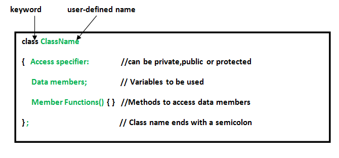

# C++ Classes and Objects

In C++, classes and objects are the basic building block that leads to Object-Oriented programming in C++. In this article, we will learn about C++ classes, objects, look at how they work and how to implement them in our C++ program.

## What is a Class in C++?

A class is a user-defined data type, which holds its own data members and member functions, which can be accessed and used by creating an instance of that class. A C++ class is like a blueprint for an object.

For Example: Consider the Class of Cars. There may be many cars with different names and brands but all of them will share some common properties like all of them will have 4 wheels, Speed Limit, Mileage range, etc. So here, the Car is the class, and wheels, speed limits, and mileage are their properties.

A Class is a user-defined data type that has data members and member functions.
Data members are the data variables and member functions are the functions used to manipulate these variables together, these data members and member functions define the properties and behaviour of the objects in a Class.
In the above example of class Car, the data member will be speed limit, mileage, etc, and member functions can be applying brakes, increasing speed, etc.
But we cannot use the class as it is. We first have to create an object of the class to use its features. An Object is an instance of a Class.

- Note: When a class is defined, no memory is allocated but when it is instantiated (i.e. an object is created) memory is allocated.

## What is an Object in C++?

When a class is defined, only the specification for the object is defined; no memory or storage is allocated. To use the data and access functions defined in the class, you need to create objects.

### Syntax to Create an Object

We can create an object of the given class in the same way we declare the variables of any other inbuilt data type .

Example

In the above statement, the object of MyClass with name obj is created.

### Accessing Data Members and Member Functions

The data members and member functions of the class can be accessed using the dot(‘.’) operator with the object. For example, if the name of the object is obj and you want to access the member function with the name printName() then you will have to write:

