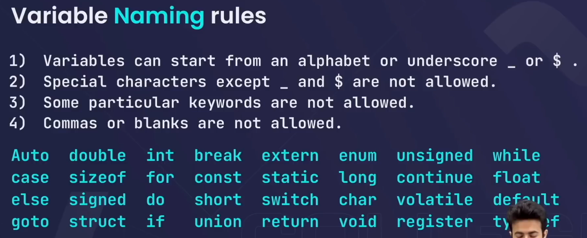
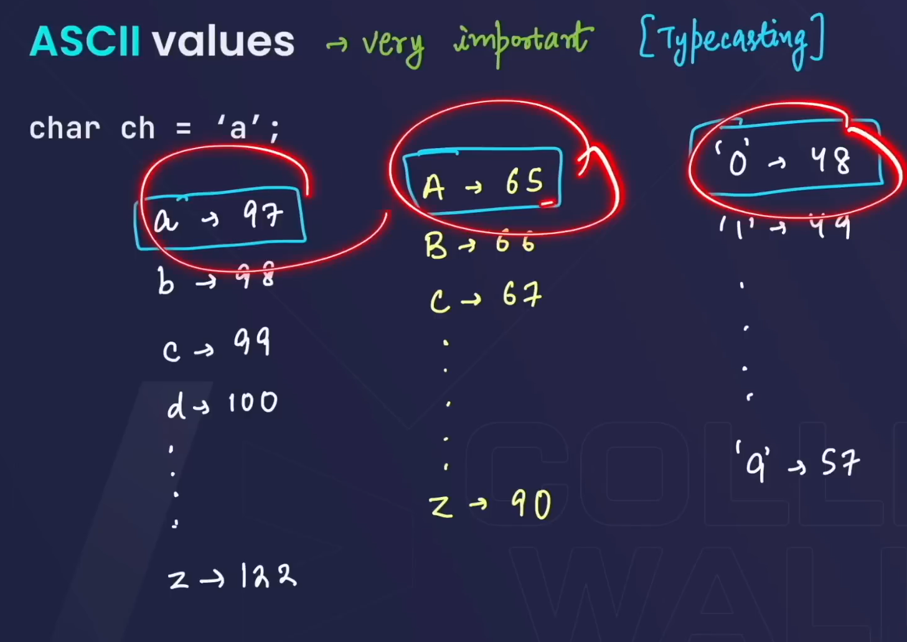
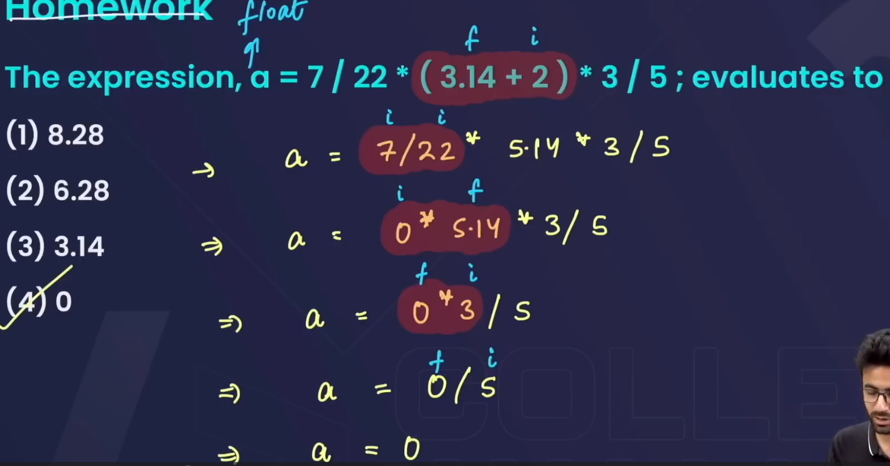
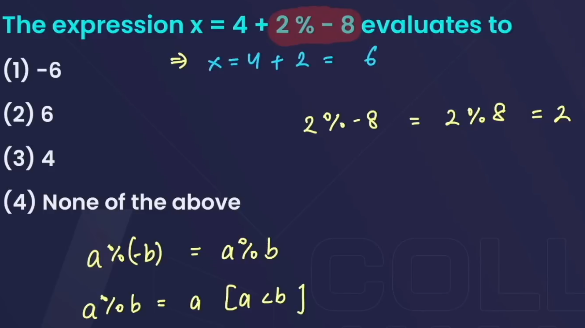
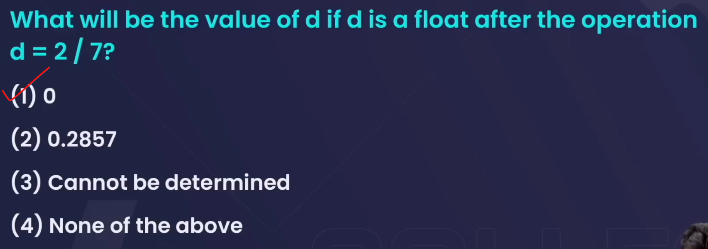

# **BASICS**

* In C++, variable names must follow these rules *

1. **Start with a letter or underscore**: A variable name can start with a letter (a-z, A-Z) or an underscore (_), but not with a digit.
   * Correct: `myVar`, `_count`
   * Incorrect: `1stVar`

2. **Contain letters, digits, and underscores**: After the first character, a variable name can contain letters, digits (0-9), and underscores.
   * Correct: `var1`, `count_2`
   * Incorrect: `my-var`

3. **No special characters**: Symbols like `@`, `$`, `%`, etc., are not allowed.
   * Incorrect: `total$`

4. **Case-sensitive**: C++ is case-sensitive, so `myVar` and `MyVar` are different variables.

5. **No keywords**: You cannot use reserved keywords (like `int`, `class`, `return`) as variable names.
   * Incorrect: `int`
6. In C++, the dollar sign (`$`) is **not** a standard part of the C++ language for variable names. According to the C++ standard, variable names can only include letters, digits, and underscores.

However, some **compilers** (like certain versions of GCC or Microsoft compilers) may allow `$` in variable names as an extension, but this is non-standard and not portable across different compilers. It’s best to avoid using `$` in variable names for C++ to ensure code compatibility across platforms.

So, while `$` might work in some environments, it’s not part of the official C++ language rules.

## **MODULUS OPERATOR**

1. **`a % b = a`, when `a < b`**:  
   When the dividend `a` is smaller than the divisor `b`, the remainder will be `a` itself.  
   Example: `7 % 10 = 7`

2. **`a % a = 0`**:  
   Any number modulo itself is always zero.  
   Example: `5 % 5 = 0`

3. **`a % (-b) = a % b`**:  
   The sign of the divisor `b` doesn't affect the result of the modulus operation.  
   Example: `10 % (-3) = 10 % 3 = 1`

4. **`(-a) % b = -(a % b)`**:  
   The modulus of a negative dividend is the negative of the modulus of its positive counterpart.  
   Example: `(-10) % 3 = -(10 % 3) = -1`
