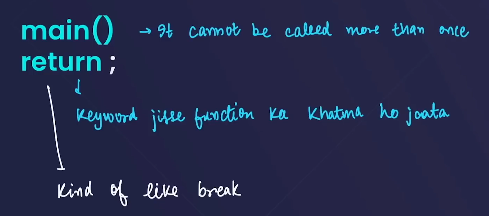
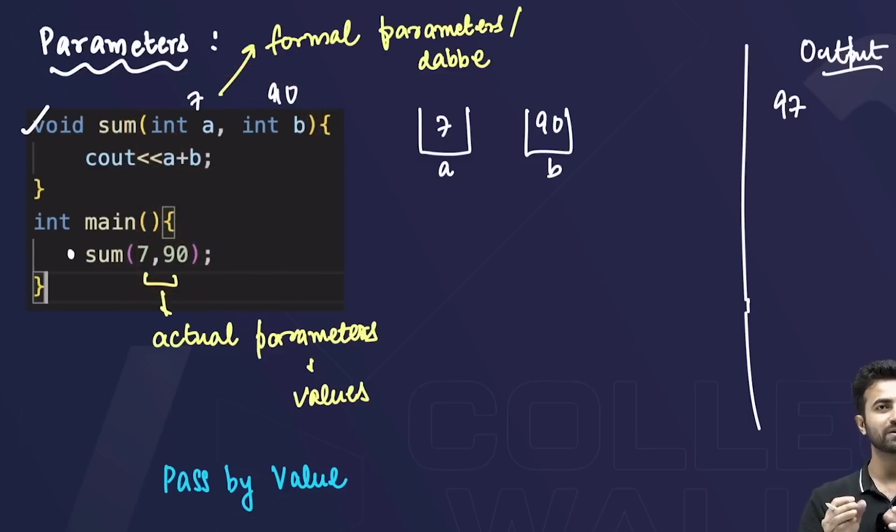
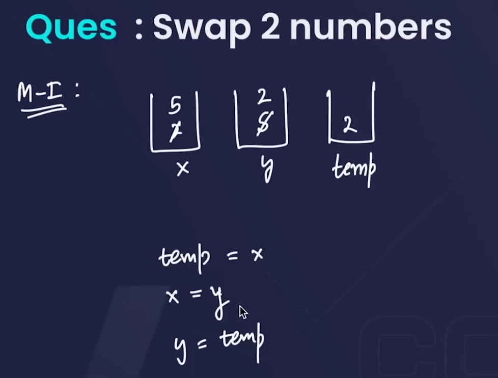
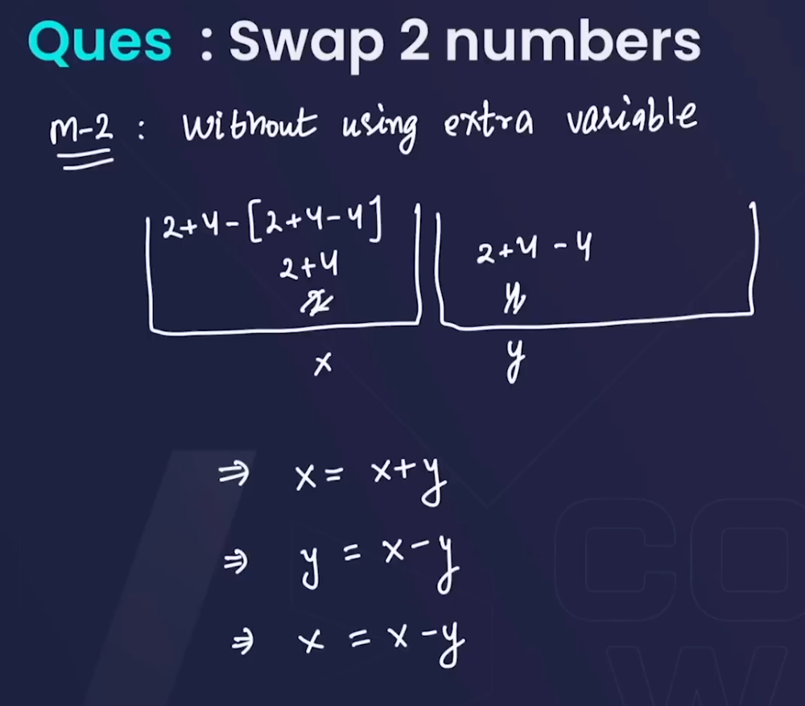
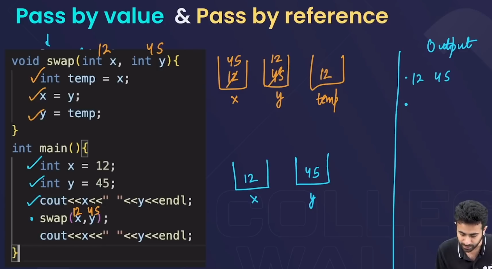
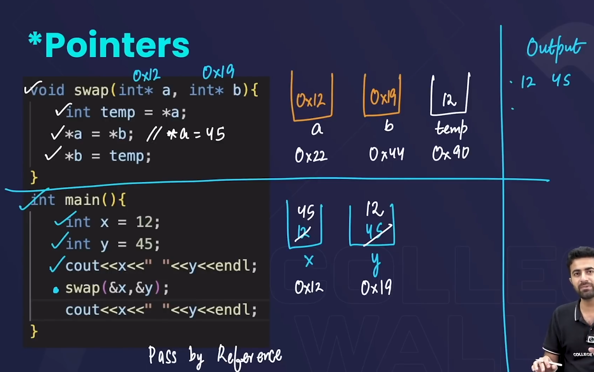

# BASICS

- always define a function before calling it and it should be declared above the function which calls it . otherwise use function prototype method (declaring all functions above main !! but not defining them ) .

## **Questions**

