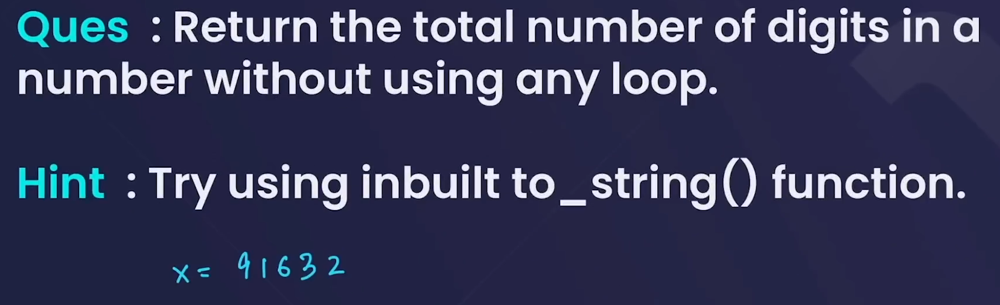

# **Built in functions**

1. size() or length() --> to get the size or length of string .

2. push_back() and append() -->

## **IMPORTANT**

1.to_string

- useful to know number of digits in a number by further using built-in length function .

2.stoi
